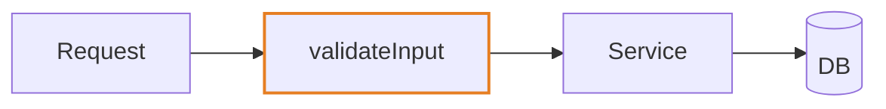

# Create Pull Request

Arguments: $ARGUMENTS

- `--draft` — create as draft.
- `--diagram` — append a `## Diagram` section with a mermaid diagram of the change (GitHub renders it natively). Optional `=flow|sequence|class|state` forces the type; otherwise pick by the shape of the change (below).

## Workflow

1. In parallel: base branch (`git remote show origin | grep 'HEAD branch'`), ticket id from the branch name (`[A-Z]+-[0-9]+`), PR template (`.github/pull_request_template.md`, `.github/PULL_REQUEST_TEMPLATE.md`, `.github/PULL_REQUEST_TEMPLATE/`, `docs/pull_request_template.md`, `pull_request_template.md`).
2. In parallel: `git diff <base>...HEAD` and the full commit list — review every commit, not just the latest.
3. Ask the user, all at once: **effort** in hours (required), **what was done** in their words (required), testing not visible in the diff, tricky parts, and any template field the diff can't answer (breaking change? type of change?).
4. Draft title and body.
   - Title matches `^(build|chore|ci|docs|feat|fix|perf|refactor|revert|style|test)(\(.*\))?: .+$`.
   - Template found → it is the body, verbatim structure: fill every section and placeholder, check applicable boxes, add nothing outside it except `## Diagram` when requested. No template → `## Summary` + `## Test plan`.
   - Reference the ticket (`Resolves TICKET-123`).
5. Commit anything uncommitted first (never open a PR on a dirty tree), push with `-u` if needed, `gh pr create` with a HEREDOC body (`--draft` if requested). Return the URL.

## Writing the body

**Concise and readable by someone who didn't see the diff.** Each section 1–4 sentences or a short bullet list. Lead with the why, then the what; the diff already shows the how. Incorporate the user's answers — don't paraphrase the diff back at them. Cut a template section's boilerplate prose only if the template marks it optional; otherwise fill it in one line.

## Diagram (`--diagram`)

Pick the type by what changed:

| Change | Type |
|---|---|
| request/response, handlers, integrations | `sequenceDiagram` |
| pipeline, branching logic, data migration | `flowchart` |
| models, types, schema | `classDiagram` / `erDiagram` |
| UI or process states | `stateDiagram-v2` |
| module refactor | `flowchart` before → after, or a dependency graph |

Rules: ≤ ~12 nodes; only the path the PR touches, not the whole system; mark new or changed nodes with a `classDef changed` style so unchanged context reads as context. If the change is linear (one file, one function) a diagram adds nothing — say so in one line instead of forcing one.

## Rules

- `gh` CLI only. Never force push. Never push from main/master without confirmation.
